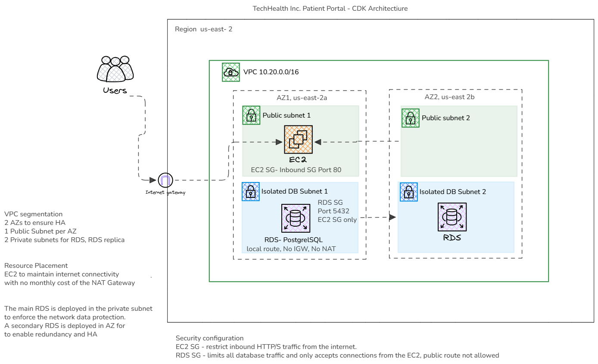

# TechHealth Patient Portal Infrastructure Modernization

## Project Overview

TechHealth Inc. operates a patient portal in an AWS environment that was originally created through manual Console configurations. After more than five years of unmanaged changes, the environment presented significant technical debt, limited auditability, outdated documentation, and an insecure network design that exposed database resources publicly.

This project modernizes the patient portal infrastructure using the AWS Cloud Development Kit (CDK) with TypeScript. The resulting Infrastructure as Code solution provides a repeatable, version-controlled, cost-conscious AWS environment with network segmentation, least-privilege access, encrypted storage, private database placement, and automated credential management.

> This is a development proof of concept. It does not contain real patient information or production ePHI.

## Project Objectives

* Replace manually configured infrastructure with AWS CDK.
* Create a reproducible and version-controlled AWS environment.
* Deploy resources across two Availability Zones.
* Place the EC2 application server in a public subnet.
* Isolate the RDS database in private subnets.
* Restrict database access to the EC2 application tier.
* Store database credentials securely in AWS Secrets Manager.
* Validate EC2-to-RDS connectivity.
* Demonstrate successful deployment, destruction, and recreation.
* Minimize recurring costs by excluding NAT Gateways.

## Architecture


The following diagram illustrates the TechHealth patient portal infrastructure deployed with AWS CDK.



## Architecture Components

| Component                 | Configuration                                      |
| ------------------------- | -------------------------------------------------- |
| AWS Region                | US East (Ohio), `us-east-2`                        |
| VPC                       | `10.20.0.0/16`                                     |
| Availability Zones        | 2                                                  |
| Public subnets            | One per Availability Zone                          |
| Private subnets           | One isolated database subnet per Availability Zone |
| Internet Gateway          | Provides internet routing for public subnets       |
| NAT Gateways              | Excluded to reduce recurring costs                 |
| EC2                       | Amazon Linux 2023, `t2.micro`                      |
| EC2 storage               | Encrypted 8 GiB GP3 EBS volume                     |
| RDS                       | PostgreSQL 16.14, `db.t3.micro`                    |
| RDS storage               | Encrypted 20 GiB GP3 storage                       |
| Credentials               | Generated and stored in AWS Secrets Manager        |
| Administration            | AWS Systems Manager Session Manager                |
| Infrastructure management | AWS CDK with TypeScript                            |
| Deployment engine         | AWS CloudFormation                                 |

## Network Design

The CDK application creates two types of subnets in each Availability Zone.

### Public Subnets

The public subnets contain routes to the VPC Internet Gateway:

```text
10.20.0.0/16 → local
0.0.0.0/0 → Internet Gateway
```

The EC2 patient portal is placed in a public subnet and receives a public IPv4 address. Its security group permits inbound HTTP traffic on TCP port 80.

### Isolated Database Subnets

The database subnets contain only the VPC local route:

```text
10.20.0.0/16 → local
```

They have no route to an Internet Gateway or NAT Gateway. Amazon RDS uses a DB subnet group containing the two isolated subnets.

Although RDS uses subnets across two Availability Zones, this cost-conscious proof of concept deploys a Single-AZ database instance. A production healthcare system should use Multi-AZ deployment.

## Security Implementation

### Network Segmentation

The application and database tiers are separated into public and isolated private subnets. The RDS instance is configured with:

```text
Publicly accessible: No
```

The database cannot be accessed directly from the internet.

### Security Groups

#### EC2 Security Group

The EC2 security group permits:

* Inbound TCP 80 for the proof-of-concept patient portal.
* Outbound HTTPS for Systems Manager, software installation, and AWS service access.
* Outbound PostgreSQL connectivity to RDS.

#### RDS Security Group

The RDS security group permits:

* Inbound TCP 5432 only from the EC2 security group.
* No database access from `0.0.0.0/0`.
* No direct access from external workstations.

Security-group references are used instead of public or private IP addresses. This allows authorized EC2 resources to reach RDS without creating broad network rules.

### Secure Administrative Access

Inbound SSH port 22 is not exposed.

The EC2 instance uses AWS Systems Manager Session Manager for administrative access. Its IAM role includes the AWS-managed `AmazonSSMManagedInstanceCore` policy.

This removes the need for:

* Public SSH access
* SSH key-pair management
* A bastion host
* Administrative IP allowlisting

### IAM and Least Privilege

The EC2 IAM role is granted permission to read only the Secrets Manager secret associated with the TechHealth database.

The application is not given broad access to all secrets or unrestricted AWS administrative permissions.

### Secrets Management

RDS credentials are generated automatically and stored in AWS Secrets Manager.

Passwords are not:

* Hard-coded in the CDK source
* Stored in GitHub
* Written into user data
* Displayed in CloudFormation outputs
* Shared through screenshots

Only the secret name is exposed as a stack output.

### Encryption

The environment implements encryption at rest for:

* EC2 EBS storage
* Amazon RDS storage
* Database credentials stored in Secrets Manager

The EC2-to-RDS connectivity test uses PostgreSQL with:

```text
sslmode=require
```

### EC2 Metadata Protection

The EC2 instance requires Instance Metadata Service Version 2:

```text
IMDSv2 required
```

This provides additional protection against unauthorized access to instance metadata and temporary IAM credentials.

## Cost Considerations

The project intentionally excludes NAT Gateways because NAT Gateways incur hourly and data-processing charges.

Cost-conscious resources include:

* One `t2.micro` EC2 instance
* One Single-AZ `db.t3.micro` RDS instance
* 8 GiB GP3 EBS storage
* 20 GiB GP3 RDS storage
* No load balancer
* No NAT Gateway
* One-day database backup retention


Resources should be destroyed when they are not being actively tested.

## Prerequisites

The following tools required:

* Node.js
* npm
* AWS CLI
* AWS CDK
* Git
* VS Code
* An AWS account with appropriate deployment permissions

Verify the tools:

```powershell
node --version
npm --version
aws --version
cdk --version
git --version
```

Confirm AWS authentication:

```powershell
aws sts get-caller-identity
```

Confirm the configured Region:

```powershell
aws configure get region
```

This project was deployed in:

```text
us-east-2
```

## Installation

Clone the repository:

```powershell
git clone https://github.com/Gees1902/techhealth-modernization.git
```

Enter the project directory:

```powershell
cd techhealth-modernization
```

Install the dependencies:

```powershell
npm install
```

Compile the TypeScript code:

```powershell
npm run build
```

## CDK Deployment

Bootstrap the AWS environment if it has not already been bootstrapped:

```powershell
cdk bootstrap
```

Generate the CloudFormation template:

```powershell
cdk synth
```

Review the proposed infrastructure changes:

```powershell
cdk diff
```

Deploy the environment:

```powershell
cdk deploy
```

The deployment creates CloudFormation outputs including:

* VPC ID
* Public subnet IDs
* Private database subnet IDs
* Route-table IDs
* EC2 security-group ID
* RDS security-group ID
* EC2 instance ID
* EC2 public IP address
* Patient portal URL
* RDS endpoint
* RDS port
* Secrets Manager secret name

Resource IDs, endpoints, account IDs, and public IP addresses should be redacted before screenshots are shared publicly.

## Validation and Testing

### Test 1: Patient Portal Availability

The EC2 user-data script installs Apache and creates a basic test page.

Open the patient portal URL:

```text
http://EC2-PUBLIC-IP
```

Expected result:

```text
TechHealth Patient Portal
Infrastructure deployed with AWS CDK.
```

This validates:

* EC2 public-subnet placement
* Public IPv4 assignment
* Internet Gateway routing
* Public route-table configuration
* Security-group access on TCP port 80
* Apache web-server operation

### Test 2: Systems Manager Access

From the AWS Console:

```text
EC2 → Instances → techhealth-patient-portal
→ Connect → Session Manager → Connect
```

A successful browser-based terminal session proves that the instance can be administered without exposing SSH.

### Test 3: EC2-to-RDS Connectivity

From the EC2 Session Manager terminal, retrieve the database secret without displaying it:

```bash
export SECRET_JSON=$(aws secretsmanager get-secret-value \
  --secret-id techhealth/rds/admin \
  --region us-east-2 \
  --query SecretString \
  --output text)
```

Extract the connection values:

```bash
export DB_HOST=$(python3 -c 'import json,os; print(json.loads(os.environ["SECRET_JSON"])["host"])')
export DB_USER=$(python3 -c 'import json,os; print(json.loads(os.environ["SECRET_JSON"])["username"])')
export PGPASSWORD=$(python3 -c 'import json,os; print(json.loads(os.environ["SECRET_JSON"])["password"])')
```

Test the encrypted PostgreSQL connection:

```bash
psql "host=$DB_HOST port=5432 dbname=techhealthdb user=$DB_USER sslmode=require" \
  -c "SELECT current_database(), current_user, version();"
```

Expected result:

```text
current_database | current_user    | version
-----------------+-----------------+----------------
techhealthdb     | techhealthadmin | PostgreSQL 16.14
```

Clear the temporary variables:

```bash
unset SECRET_JSON DB_HOST DB_USER PGPASSWORD
```

### Test 4: External Database Isolation

Retrieve the RDS endpoint from CloudFormation:

```powershell
$techHealthRdsEndpoint = aws cloudformation describe-stacks `
  --stack-name TechhealthModernizationStack `
  --region us-east-2 `
  --query "Stacks[0].Outputs[?OutputKey=='RdsEndpoint'].OutputValue | [0]" `
  --output text
```

Test port 5432 from the local computer:

```powershell
Test-NetConnection `
  -ComputerName $techHealthRdsEndpoint `
  -Port 5432
```

Expected result:

```text
TcpTestSucceeded : False
```

The failed external connection, combined with the successful EC2 connection, demonstrates that the database is isolated and accepts traffic only from the authorized application tier.

### Test 5: Infrastructure Consistency

Confirm that deployed infrastructure matches the CDK code:

```powershell
cdk diff
```

Expected result:

```text
There were no differences
```

### Test 6: Destruction and Recreation

Destroy the environment:

```powershell
cdk destroy
```

Recreate the complete environment:

```powershell
cdk deploy
```

Successful destruction and recreation demonstrate that the architecture is reproducible and does not depend on undocumented Console configurations.

## Testing Evidence

Recommended screenshot structure:

```text
screenshots/
├── architecture/
│   └── techhealth-architecture.png
├── deployment/
│   ├── cdk-deploy-success.png
│   ├── cdk-diff-no-changes.png
│   ├── cdk-destroy-success.png
│   └── cdk-redeploy-success.png
├── network/
│   ├── availability-zones.png
│   ├── public-route-table.png
│   ├── private-route-table.png
│   └── no-nat-gateway.png
├── security-groups/
│   ├── ec2-security-group.png
│   └── rds-security-group.png
├── ec2/
│   ├── ec2-status-checks.png
│   ├── patient-portal.png
│   └── session-manager.png
└── connectivity/
    ├── ec2-to-rds-success.png
    └── external-rds-connection-blocked.png
```

## Challenges and Troubleshooting

### PostgreSQL Engine-Version Mismatch

The initial deployment specified PostgreSQL `16.3`. RDS returned:

```text
Cannot find version 16.3 for postgres
```

The available versions in `us-east-2` were queried using:

```powershell
aws rds describe-db-engine-versions `
  --engine postgres `
  --region us-east-2 `
  --query "DBEngineVersions[?starts_with(EngineVersion, '16.')].EngineVersion" `
  --output table
```

AWS supported PostgreSQL `16.15`, but the installed CDK validation schema recognized versions only through `16.14`. Version `16.14` was selected because it was supported by both AWS RDS and the local CDK toolchain.

### CDK Construct Ordering

The EC2 output declarations were initially placed before the EC2 instance was created. This caused:

```text
TypeError: Cannot read properties of undefined
```

The outputs were moved after the EC2 construct. This reinforced that CDK constructs must exist before another construct references their properties.

### Duplicate Construct Names

While moving the EC2 outputs, the original blocks were copied instead of removed. CDK reported:

```text
There is already a Construct with name 'Ec2InstanceId'
```

The duplicate output blocks were removed so every construct retained a unique logical ID.

### EC2 Web Server Timeout

The EC2 public address initially timed out. Troubleshooting included:

* Confirming EC2 passed both status checks
* Verifying the security-group rule for TCP port 80
* Connecting through Session Manager
* Checking the Apache service
* Installing and starting Apache

The web server was restored using:

```bash
sudo dnf install -y httpd
sudo systemctl enable --now httpd
curl http://localhost
```

## Lessons Learned

1. Infrastructure as Code improves repeatability, auditability, documentation, and recovery.
2. Public and isolated subnet types provide clear separation between application and database resources.
3. A public route does not independently make a resource publicly accessible; public IP assignment and security-group rules are also required.
4. Security-group references are safer and easier to maintain than hard-coded IP rules.
5. Systems Manager reduces administrative exposure by eliminating public SSH access.
6. Secrets Manager prevents database credentials from being embedded in source code.
7. AWS service availability and supported engine versions can vary by Region and change over time.
8. `cdk synth` and `cdk diff` should be used before every deployment.
9. Destruction and recreation are essential tests of infrastructure reproducibility.
10. Cost constraints can influence architecture, but security tradeoffs must be documented clearly.

## Production Recommendations

This proof of concept follows the project requirement to place EC2 in a public subnet and exclude NAT Gateways. A production healthcare architecture should add:

* Application Load Balancer in public subnets
* EC2 or container workloads in private application subnets
* HTTPS using AWS Certificate Manager
* AWS WAF
* Multi-AZ RDS
* RDS deletion protection
* Longer backup retention
* Customer-managed AWS KMS keys
* CloudTrail
* VPC Flow Logs
* Amazon GuardDuty
* AWS Security Hub CSPM
* AWS Config
* CloudWatch alarms and centralized logging
* Route 53 DNS
* Automated CDK tests
* CI/CD security scanning and deployment approvals
* AWS Business Associate Addendum before processing ePHI

## Project Outcome

TechHealth Inc.’s manually configured patient portal infrastructure was successfully replaced with a version-controlled AWS CDK solution.

The project demonstrated:

* Secure network segmentation
* Public application and private database placement
* Least-privilege security-group communication
* Secure administrative access
* Encrypted compute and database storage
* Automated credential management
* Successful EC2-to-RDS connectivity
* Blocked direct database access
* Consistent deployment and destruction
* Complete infrastructure recreation from code

The modernization establishes a stronger foundation for future automation, security testing, compliance monitoring, and production-scale deployment.

## Repository

[TechHealth Infrastructure Modernization](https://github.com/Gees1902/techhealth-modernization)
